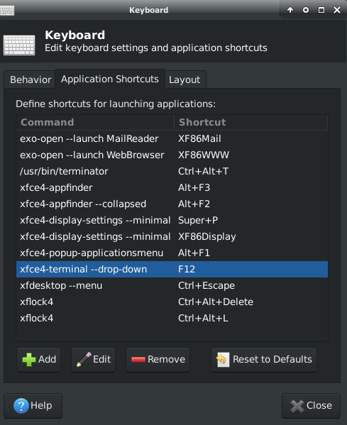

Return to table of contents [`toc`](https://jcmariscal.github.io/misc-notes/)

# Bizanz: GIF full screen capture

Bizanz provides a nice command line interface for recording GIFs.

```bash
byzanz-record --duration=30 --delay=2 --cursor -w 1366 -h 768 foo.gif
```

# convert djvu to pdf

Use [djvu2pdf](http://0x2a.at/s/projects/djvu2pdf) tool or simply:

```bash
sudo apt-get install djvulibre-bin ghostscript

ddjvu -format=pdf -quality=85 -verbose foo.djvu foo-output.pdf
```

# download a youtube playlist

```bash
youtube-dl --write-description --write-info-json --write-annotations  --write-sub --write-thumbnail  --write-annotations --write-info-json --yes-playlist --verbose {playlist-link}
```

# Download segmented audio/video (M4S, eg. vimeo, news-websites, etc.)

- Load webpage and find the mpd link.
<p></p>
- Copy link and use the following command: `youtube-dl {mpd-link}`
- Other method is to wget all m4s files and join the files.
- Another method is to use an script, modified from [here](https://gist.github.com/alexeygrigorev/a1bc540925054b71e1a7268e50ad55cd)

```python
import requests
import base64
from tqdm import tqdm
import sys

master_json_url = sys.argv[1]
base_url = master_json_url[:master_json_url.rfind('/', 0, -26) + 1]

resp = requests.get(master_json_url)
content = resp.json()

heights = [(i, d['height']) for (i, d) in enumerate(content['video'])]
idx, _ = max(heights, key=lambda (_, h): h)
video = content['video'][idx]
video_base_url = base_url + video['base_url']
print 'base url:', video_base_url

filename = sys.argv[2] if sys.argv[2] else 'video_%d.mp4' % video['id']
print 'saving to %s' % filename

video_file = open(filename, 'wb')

init_segment = base64.b64decode(video['init_segment'])
video_file.write(init_segment)

for segment in tqdm(video['segments']):
    segment_url = video_base_url + segment['url']
    resp = requests.get(segment_url, stream=True)
    if resp.status_code != 200:
        print 'not 200!'
        print resp
        print segment_url
        break
    for chunk in resp:
        video_file.write(chunk)

video_file.flush()
video_file.close()
```
# ffmpeg

- shuffle, and join mp3 files: (for more on concatenation see [here](https://trac.ffmpeg.org/wiki/Concatenate)

```bash
$ printf "file '%s'\n" ./*.mp3 >> input.txt
$ shuf -o input2.txt input.txt
$ ffmpeg -f concat -safe 0 -i input2.txt -c copy output.mp3

# or just join in 1 liner
$ ffmpeg -f concat -safe 0 -i <(printf "file '%s'\n" ./*.mp3) -c copy output.mp3
```
# google sheets

- google sheets function list: https://support.google.com/docs/table/25273?hl=en&ref_topic=3105625
- Insert static date in cell: `Ctr ;`
- insert static time in cell: `Ctrl shift ;`
- Regular expression syntax reference: https://github.com/google/re2/blob/master/doc/syntax.txt
  - useful cell formulas: `REGEXTRACT`, `REGEXMATCH`, `REGEXREPLACE`, `SUBSTITUTE`,`REPLACE`

# grep

- grep for command argument:
```bash
$ ls --help | egrep -- -a
```

# mpv

- Play youtube in ascii in the terminal use:
```bash
$ DISPLAY= mpv --quiet -vo caca 'https://www.youtube.com/watch?v=3hoThry5WsY'
```
- list of keyboard shortcuts:
https://github.com/mpv-player/mpv/blob/master/etc/input.conf 

# pandoc

- convert from org-mode file to github flavoured markdown
```bash
$ pandoc --to=gfm foo.org -o foo.md
```
# restic

- initiate repository

```bash
$ restic init --repo /foo/repo-location
```
- backup home folder

```bash
$ restic -r /foo/repo-location --verbose backup /home/
```

# terminator

Some interesting config files can be found here:
- [Top-down terminator](https://bytefreaks.net/howtos/howto-make-terminator-terminal-act-like-guake-terminal-in-ubuntu-11-10)
- [Terminator split configuration](https://unix.stackexchange.com/questions/168436/how-to-open-terminal-split-to-9-terminals-and-switch-between-them-using-one-scr)

# wget

- copy website recursively without parent directory:
```bash
wget --recursive --level=inf --no-parent --random-wait --no-cache --convert-links --adjust-extension --page-requisites -e robots=off --user-agent=mozilla www.foo.org/data/
```

# XFCE top-down terminal configuration

- Keyboard settings, add the following shortcut:

```bash
xfce4-terminal --drop-down
```
Emacs could also be launched directly in terminal mode with the following:

```bash
xfce4-terminal --drop-down --tab  --title=emacs -e "emacs -nw"
```

I assigned `f12` to launch the terminal. It is very handy.


